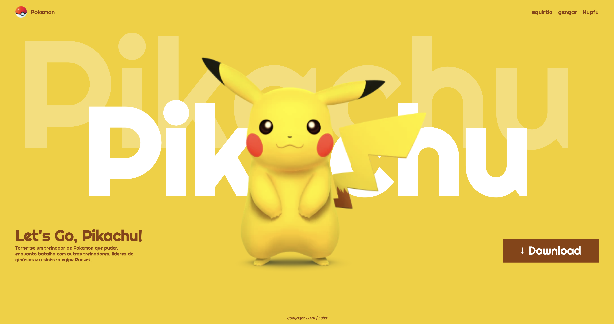

# Landing page - let's Go, Pikachu

## Sobre 
site do tipo landing Page para divulgar o jogo Let's Go, Pikachu.
O intuito deste projeto é colocar em pratica o conhecimento adquirido sobre as linguagens de marcação, HTML, CSS e MarkDown, realizadas no curso de desenvolvimento de sistemas no [Senai de Jandira](https://sp.senai.br/unidade/jandira/).

## Tecnologias Utilizadas
- HTML
-CSS
-MarkDown
-Git

## Autor 
- [Luiz Henrique](https://www.linkedin.com/in/luiz-santos-788507327/)